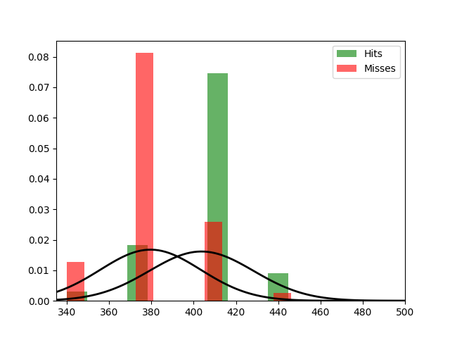

Fit results Hits: mu = 403.70,  std = 24.68
Fit results Misses: mu = 379.60,  std = 23.79
5000
5000

Threshhold:  392.3227192873726 
Accuracy:  0.7816

Threshhold:  -267.8282785554917 
Accuracy:  0.5

THRESHHOLD:  392.3227192873726

 [[3987 1013]
 [1171 3829]] 

              precision    recall  f1-score   support

         Hit       0.77      0.80      0.78      5000
        Miss       0.79      0.77      0.78      5000

    accuracy                           0.78     10000
   macro avg       0.78      0.78      0.78     10000
weighted avg       0.78      0.78      0.78     10000

Accuracy:  0.7816
Results for the Transmission:

 [[2893 2347]
 [1760 3000]] 

              precision    recall  f1-score   support

          0
       0.62      0.55      0.58      5240
          1
       0.56      0.63      0.59      4760

    accuracy                           0.59     10000
   macro avg       0.59      0.59      0.59     10000
weighted avg       0.59      0.59      0.59     10000

Wasserstein-Distance: 0.05870000

