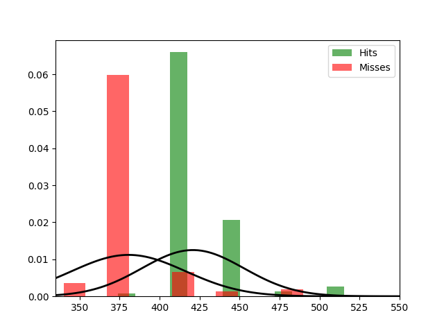

Fit results Hits: mu = 380.66,  std = 35.59
Fit results Misses: mu = 420.85,  std = 31.88
5000
5000

Threshhold:  768.985161345061 
Accuracy:  0.4997

Threshhold:  398.77637241744264 
Accuracy:  0.9266

THRESHHOLD:  398.77637241744264

 [[4310  690]
 [  44 4956]] 

              precision    recall  f1-score   support

         Hit       0.99      0.86      0.92      5000
        Miss       0.88      0.99      0.93      5000

    accuracy                           0.93     10000
   macro avg       0.93      0.93      0.93     10000
weighted avg       0.93      0.93      0.93     10000

Accuracy:  0.9266
Results for the Transmission:

 [[2578 2502]
 [1578 3342]] 

              precision    recall  f1-score   support

          0
       0.62      0.51      0.56      5080
          1
       0.57      0.68      0.62      4920

    accuracy                           0.59     10000
   macro avg       0.60      0.59      0.59     10000
weighted avg       0.60      0.59      0.59     10000

Wasserstein-Distance: 0.09240000

