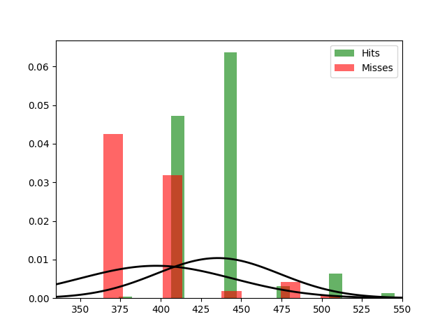

Fit results Hits: mu = 435.53,  std = 38.42
Fit results Misses: mu = 397.20,  std = 47.61
5000
5000

Threshhold:  605.4816419562198 
Accuracy:  0.5

Threshhold:  408.71169439867344 
Accuracy:  0.7619

THRESHHOLD:  408.71169439867344

 [[3057 1943]
 [ 438 4562]] 

              precision    recall  f1-score   support

         Hit       0.87      0.61      0.72      5000
        Miss       0.70      0.91      0.79      5000

    accuracy                           0.76     10000
   macro avg       0.79      0.76      0.76     10000
weighted avg       0.79      0.76      0.76     10000

Accuracy:  0.7619
Results for the Transmission:

 [] 

