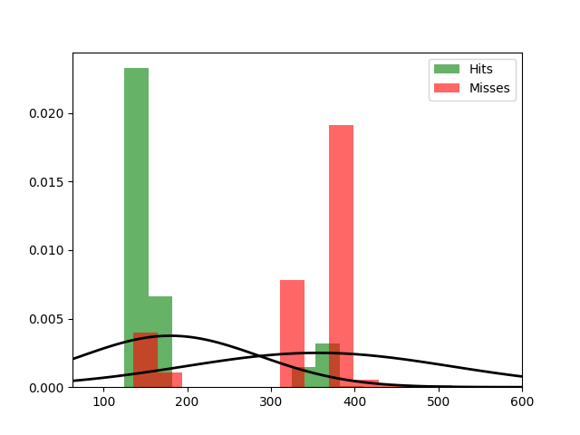

Fit results Hits: mu = 180.04,  std = 106.39
Fit results Misses: mu = 356.39,  std = 159.51
5000
5000

Threshhold:  286.523942527153 
Accuracy:  0.8535

Threshhold:  -209.1392294942587 
Accuracy:  0.5

THRESHHOLD:  286.523942527153

 [[4273  727]
 [ 738 4262]] 

              precision    recall  f1-score   support

         Hit       0.85      0.85      0.85      5000
        Miss       0.85      0.85      0.85      5000

    accuracy                           0.85     10000
   macro avg       0.85      0.85      0.85     10000
weighted avg       0.85      0.85      0.85     10000

Accuracy:  0.8535
Results for the Transmission:

 [[3832 1168]
 [1185 3815]] 

              precision    recall  f1-score   support

          0
       0.76      0.77      0.77      5000
          1
       0.77      0.76      0.76      5000

    accuracy                           0.76     10000
   macro avg       0.76      0.76      0.76     10000
weighted avg       0.76      0.76      0.76     10000

Wasserstein-Distance: 0.00170000

