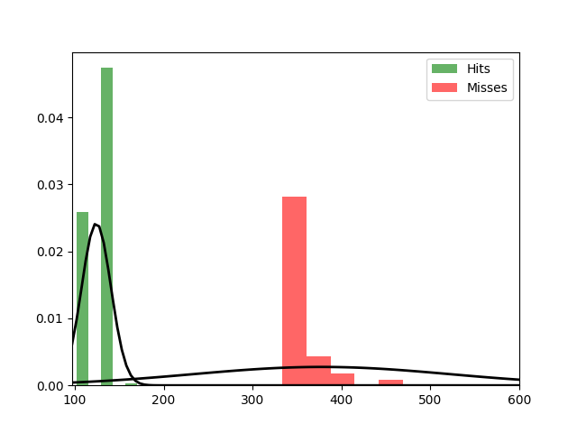

Fit results Hits: mu = 124.20,  std = 16.48
Fit results Misses: mu = 377.60,  std = 144.97
5000
5000

Threshhold:  166.14473369683822 
Accuracy:  0.9979

Threshhold:  75.62333480946432 
Accuracy:  0.5

THRESHHOLD:  166.14473369683822

 [[4979   21]
 [   0 5000]] 

              precision    recall  f1-score   support

         Hit       1.00      1.00      1.00      5000
        Miss       1.00      1.00      1.00      5000

    accuracy                           1.00     10000
   macro avg       1.00      1.00      1.00     10000
weighted avg       1.00      1.00      1.00     10000

Accuracy:  0.9979
Results for the Transmission:

 [[4341  259]
 [ 473 4927]] 

              precision    recall  f1-score   support

          0
       0.90      0.94      0.92      4600
          1
       0.95      0.91      0.93      5400

    accuracy                           0.93     10000
   macro avg       0.93      0.93      0.93     10000
weighted avg       0.93      0.93      0.93     10000

Wasserstein-Distance: 0.02140000

