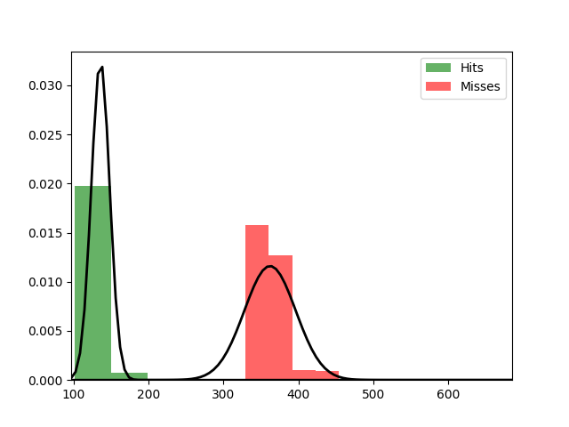

Fit results Hits: mu = 136.16,  std = 12.28
Fit results Misses: mu = 362.24,  std = 34.36
5000
5000

Threshhold:  197.5718218165078 
Accuracy:  0.9962

Threshhold:  8.60580505388124 
Accuracy:  0.5

THRESHHOLD:  197.5718218165078

 [[4962   38]
 [   0 5000]] 

              precision    recall  f1-score   support

         Hit       1.00      0.99      1.00      5000
        Miss       0.99      1.00      1.00      5000

    accuracy                           1.00     10000
   macro avg       1.00      1.00      1.00     10000
weighted avg       1.00      1.00      1.00     10000

Accuracy:  0.9962
Results for the Transmission:

 [[4903  247]
 [ 327 4523]] 

              precision    recall  f1-score   support

          0
       0.94      0.95      0.94      5150
          1
       0.95      0.93      0.94      4850

    accuracy                           0.94     10000
   macro avg       0.94      0.94      0.94     10000
weighted avg       0.94      0.94      0.94     10000

Wasserstein-Distance: 0.00800000

