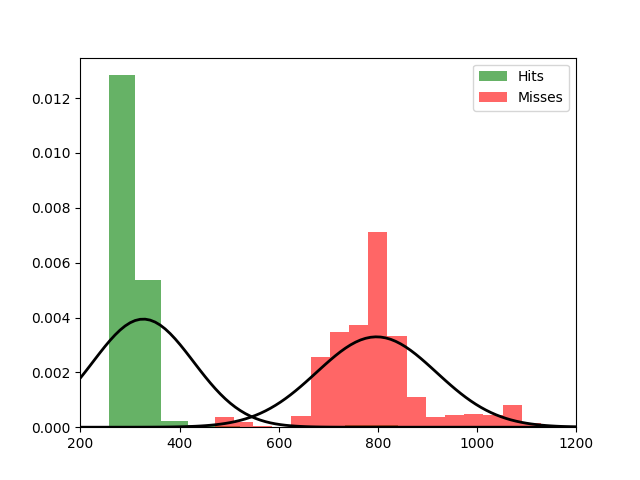

Fit results Hits: mu = 326.70,  std = 101.20
Fit results Misses: mu = 797.34,  std = 121.07
5000
5000

Threshhold:  -2075.875624699739 
Accuracy:  0.5

Threshhold:  545.6478755426971 
Accuracy:  0.9812

THRESHHOLD:  545.6478755426971

 [[4923   77]
 [ 111 4889]] 

              precision    recall  f1-score   support

         Hit       0.98      0.98      0.98      5000
        Miss       0.98      0.98      0.98      5000

    accuracy                           0.98     10000
   macro avg       0.98      0.98      0.98     10000
weighted avg       0.98      0.98      0.98     10000

Accuracy:  0.9812

