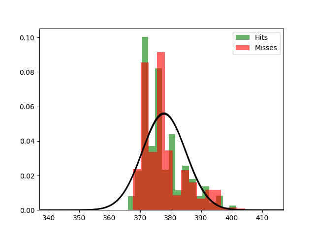

Fit results Hits: mu = 377.81,  std = 7.09
Fit results Misses: mu = 377.87,  std = 7.17
5000
5000

Threshhold:  382.6856151048281 
Accuracy:  0.5

Threshhold:  367.3530645024168 
Accuracy:  0.5

THRESHHOLD:  382.6856151048281

 [[3663 1337]
 [3663 1337]] 

              precision    recall  f1-score   support

         Hit       0.50      0.73      0.59      5000
        Miss       0.50      0.27      0.35      5000

    accuracy                           0.50     10000
   macro avg       0.50      0.50      0.47     10000
weighted avg       0.50      0.50      0.47     10000

Accuracy:  0.5
Results for the Transmission:

