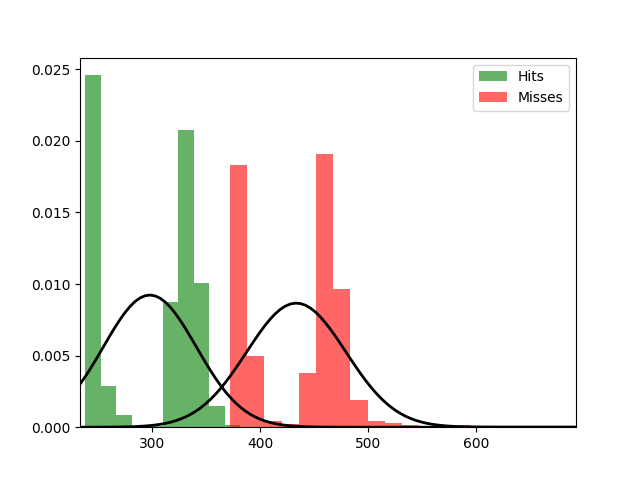

Fit results Hits: mu = 297.77,  std = 43.21
Fit results Misses: mu = 433.58,  std = 46.02
5000
5000

Threshhold:  -1788.1555035957074 
Accuracy:  0.5

Threshhold:  364.4610150448364 
Accuracy:  0.9979

THRESHHOLD:  364.4610150448364

 [[4979   21]
 [   0 5000]] 

              precision    recall  f1-score   support

         Hit       1.00      1.00      1.00      5000
        Miss       1.00      1.00      1.00      5000

    accuracy                           1.00     10000
   macro avg       1.00      1.00      1.00     10000
weighted avg       1.00      1.00      1.00     10000

Accuracy:  0.9979
Results for the Transmission:

 [[5489    0]
 [  10 5501]] 

              precision    recall  f1-score   support

          0
       1.00      1.00      1.00      5489
          1
       1.00      1.00      1.00      5511

    accuracy                           1.00     11000
   macro avg       1.00      1.00      1.00     11000
weighted avg       1.00      1.00      1.00     11000

Wasserstein-Distance: 0.00090909

