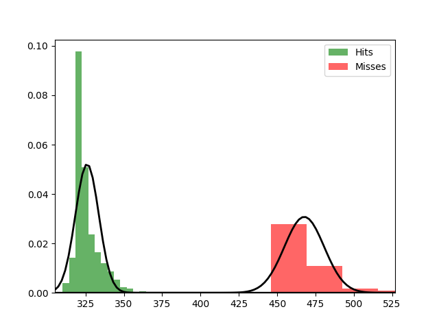

Fit results Hits: mu = 326.04,  std = 7.65
Fit results Misses: mu = 467.72,  std = 12.97
5000
5000

Threshhold:  378.97300945229324 
Accuracy:  0.9985

Threshhold:  121.91111298180928 
Accuracy:  0.5

THRESHHOLD:  378.97300945229324

 [[4985   15]
 [   0 5000]] 

              precision    recall  f1-score   support

         Hit       1.00      1.00      1.00      5000
        Miss       1.00      1.00      1.00      5000

    accuracy                           1.00     10000
   macro avg       1.00      1.00      1.00     10000
weighted avg       1.00      1.00      1.00     10000

Accuracy:  0.9985
Results for the Transmission:

 [[5030    0]
 [   9 4961]] 

              precision    recall  f1-score   support

          0
       1.00      1.00      1.00      5030
          1
       1.00      1.00      1.00      4970

    accuracy                           1.00     10000
   macro avg       1.00      1.00      1.00     10000
weighted avg       1.00      1.00      1.00     10000

Wasserstein-Distance: 0.00090000

