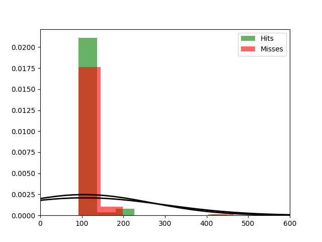

Fit results Hits: mu = 105.81,  std = 161.45
Fit results Misses: mu = 106.33,  std = 191.08
5000
5000

Threshhold:  279.73772296220943 
Accuracy:  0.5003

Threshhold:  -70.73063839125415 
Accuracy:  0.5

THRESHHOLD:  279.73772296220943

 [[4961   39]
 [4958   42]] 

              precision    recall  f1-score   support

         Hit       0.50      0.99      0.67      5000
        Miss       0.52      0.01      0.02      5000

    accuracy                           0.50     10000
   macro avg       0.51      0.50      0.34     10000
weighted avg       0.51      0.50      0.34     10000

Accuracy:  0.5003

