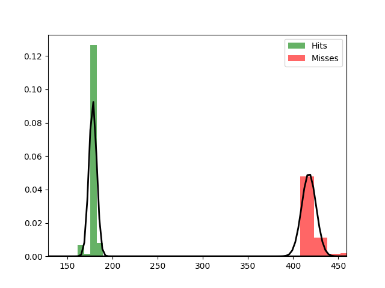

Fit results Hits: mu = 178.43,  std = 4.28
Fit results Misses: mu = 417.41,  std = 8.01
5000
5000

Threshhold:  261.69847196068883 
Accuracy:  0.9999

Threshhold:  -95.36949113521689 
Accuracy:  0.5

THRESHHOLD:  261.69847196068883

 [[4999    1]
 [   0 5000]] 

              precision    recall  f1-score   support

         Hit       1.00      1.00      1.00      5000
        Miss       1.00      1.00      1.00      5000

    accuracy                           1.00     10000
   macro avg       1.00      1.00      1.00     10000
weighted avg       1.00      1.00      1.00     10000

Accuracy:  0.9999
Results for the Transmission:

 [[4723   87]
 [  96 5094]] 

              precision    recall  f1-score   support

          0
       0.98      0.98      0.98      4810
          1
       0.98      0.98      0.98      5190

    accuracy                           0.98     10000
   macro avg       0.98      0.98      0.98     10000
weighted avg       0.98      0.98      0.98     10000

Wasserstein-Distance: 0.00090000

