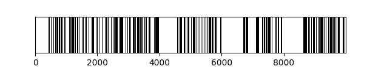
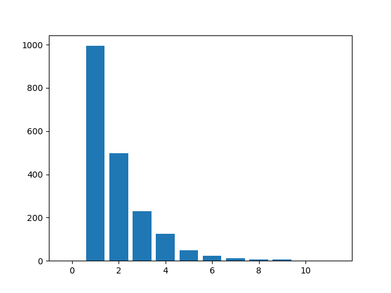

Fit results Hits: mu = 139.38,  std = 15.26
Fit results Misses: mu = 141.87,  std = 15.44
5000
5000

Threshhold:  141.667247945282 
Accuracy:  0.4589

Threshhold:  -83.44862224644491 
Accuracy:  0.5

THRESHHOLD:  -83.44862224644491

 [[5000    0]
 [5000    0]] 

              precision    recall  f1-score   support

         Hit       0.50      1.00      0.67      5000
        Miss       0.00      0.00      0.00      5000

    accuracy                           0.50     10000
   macro avg       0.25      0.50      0.33     10000
weighted avg       0.25      0.50      0.33     10000

Accuracy:  0.5
Results for the Transmission:

 [[3317 1853]
 [1907 2923]] 

              precision    recall  f1-score   support

          0
       0.63      0.64      0.64      5170
          1
       0.61      0.61      0.61      4830

    accuracy                           0.62     10000
   macro avg       0.62      0.62      0.62     10000
weighted avg       0.62      0.62      0.62     10000

Wasserstein-Distance: 0.00540000

Accuracy: 0.624  
Wassersteind: 0.00539999999999996  
Normal Distributed projected Wassersteind: 0.004814

