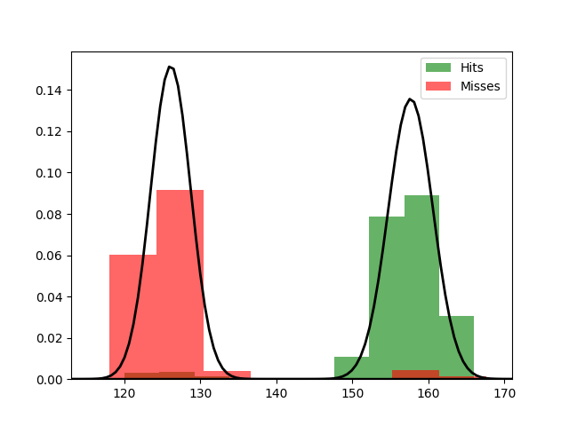

Fit results Hits: mu = 157.66,  std = 2.94
Fit results Misses: mu = 126.10,  std = 2.63
5000
5000

Threshhold:  -141.7676686684372 
Accuracy:  0.5

Threshhold:  141.02934195068664 
Accuracy:  0.9632

THRESHHOLD:  141.02934195068664

 [[4816  184]
 [ 184 4816]] 

              precision    recall  f1-score   support

         Hit       0.96      0.96      0.96      5000
        Miss       0.96      0.96      0.96      5000

    accuracy                           0.96     10000
   macro avg       0.96      0.96      0.96     10000
weighted avg       0.96      0.96      0.96     10000

Accuracy:  0.9632
Results for the Transmission:

 [[4554  206]
 [ 207 5033]] 

              precision    recall  f1-score   support

          0
       0.96      0.96      0.96      4760
          1
       0.96      0.96      0.96      5240

    accuracy                           0.96     10000
   macro avg       0.96      0.96      0.96     10000
weighted avg       0.96      0.96      0.96     10000

Wasserstein-Distance: 0.00010000

