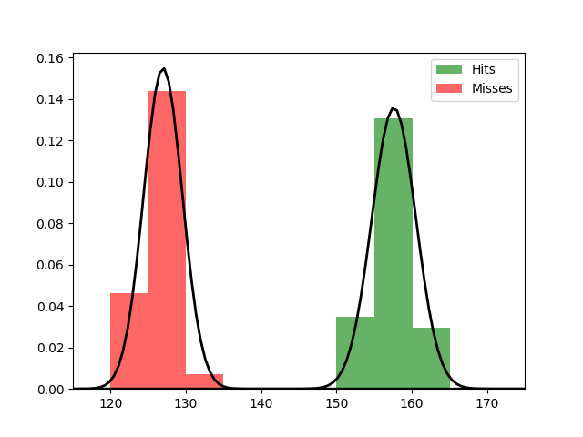

Fit results Hits: mu = 157.63,  std = 2.94
Fit results Misses: mu = 126.97,  std = 2.57
5000
5000

Threshhold:  141.31712938079647 
Accuracy:  0.9939

Threshhold:  -89.30090792219593 
Accuracy:  0.5

THRESHHOLD:  141.31712938079647

 [[5000    0]
 [  61 4939]] 

              precision    recall  f1-score   support

         Hit       0.99      1.00      0.99      5000
        Miss       1.00      0.99      0.99      5000

    accuracy                           0.99     10000
   macro avg       0.99      0.99      0.99     10000
weighted avg       0.99      0.99      0.99     10000

Accuracy:  0.9939
Results for the Transmission:

 [[4986    4]
 [   0 5010]] 

              precision    recall  f1-score   support

          0
       1.00      1.00      1.00      4990
          1
       1.00      1.00      1.00      5010

    accuracy                           1.00     10000
   macro avg       1.00      1.00      1.00     10000
weighted avg       1.00      1.00      1.00     10000

Wasserstein-Distance: 0.00040000

