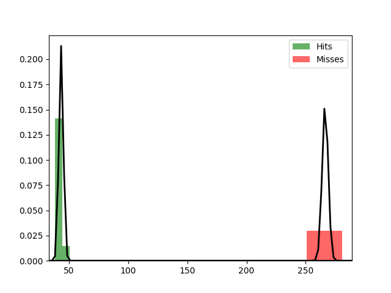

Fit results Hits: mu = 43.37,  std = 1.87
Fit results Misses: mu = 266.41,  std = 2.55
5000
5000

Threshhold:  -571.9144006813663 
Accuracy:  0.5

Threshhold:  137.78340453153146 
Accuracy:  0.9901

THRESHHOLD:  137.78340453153146

 [[5000    0]
 [  99 4901]] 

              precision    recall  f1-score   support

         Hit       0.98      1.00      0.99      5000
        Miss       1.00      0.98      0.99      5000

    accuracy                           0.99     10000
   macro avg       0.99      0.99      0.99     10000
weighted avg       0.99      0.99      0.99     10000

Accuracy:  0.9901
Results for the Transmission:

 [[4784  476]
 [ 474 4266]] 

              precision    recall  f1-score   support

          0
       0.91      0.91      0.91      5260
          1
       0.90      0.90      0.90      4740

    accuracy                           0.91     10000
   macro avg       0.90      0.90      0.90     10000
weighted avg       0.91      0.91      0.91     10000

Wasserstein-Distance: 0.00020000

