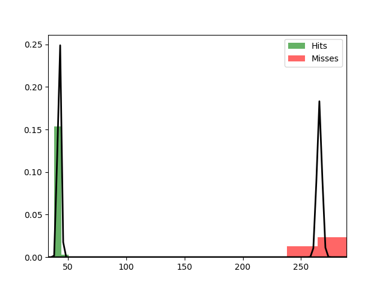

Fit results Hits: mu = 42.62,  std = 1.40
Fit results Misses: mu = 265.75,  std = 2.18
5000
5000

Threshhold:  -361.5462460898699 
Accuracy:  0.5

Threshhold:  130.05762621141798 
Accuracy:  0.0

THRESHHOLD:  -361.5462460898699

 [[5000    0]
 [5000    0]] 

              precision    recall  f1-score   support

         Hit       0.50      1.00      0.67      5000
        Miss       0.00      0.00      0.00      5000

    accuracy                           0.50     10000
   macro avg       0.25      0.50      0.33     10000
weighted avg       0.25      0.50      0.33     10000

Accuracy:  0.5
Results for the Transmission:

 [[5080    0]
 [   0 4920]] 

              precision    recall  f1-score   support

          0
       1.00      1.00      1.00      5080
          1
       1.00      1.00      1.00      4920

    accuracy                           1.00     10000
   macro avg       1.00      1.00      1.00     10000
weighted avg       1.00      1.00      1.00     10000

Wasserstein-Distance: 0.00000000

